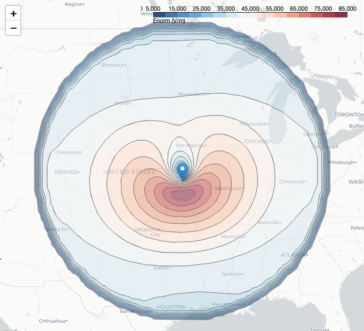

# The Karzas-Latter-Seiler Model of a High-Altitude Electromagnetic Pulse

## Introduction
This repository contains Python code for modeling the early (E1) phase of a high-altitude electromagnetic pulse (EMP). The EMP is modeled using a variant of the well-known [Karzas-Latter model](https://journals.aps.org/pr/abstract/10.1103/PhysRev.137.B1369) introduced by [Seiler](https://apps.dtic.mil/sti/citations/ADA009208). The code may be used to produce the characteristic "smile diagrams", which depict the peak intensity of the electric field over the surface of the Earth. The diagram below corresponds to a blast detonated 100 km directly overhead Topeka, Kansas.



## Contents
The repository is organized as follows:
- `emp/` contains the core code for the package
    - `emp/model.py`: contains the EMP model class and other useful functions
    - `emp/geometry.py`: contains code for geometrical calculations
    - `emp/constants.py`: contains constants of nature and default model parameters
    - `emp/region_scan.py`: contains code for scanning over a range of target points and creating the "smile" diagrams
    - `emp/HOB_yield_scan.py`: contains code for scanning over a range of height of burst (HOB) values and yields
- `scripts/` contains Python scripts used to run the model in various use cases
    - `scripts/run_line_of_sight.py`: perform a single line of sight integration
    - `scripts/run_region_scan.py`: perform a 2d scan over latitude and longitude coordinates and make the "smile" diagram
    - `scripts/run_HOB_yield_scan.py`: perform a scan over the height of burst (HOB) and yield
- `notebooks/` contains a Jupyter notebook used to illustrate how to use the code
- `Seiler Digitized Data` a directory containing digitized data from select figures in the original Seiler report. The data was digitized using [this online tool](https://apps.automeris.io/wpd/).

## Installation

### Prerequisites
- Python 3.9 or higher
- [Poetry](https://python-poetry.org/) (recommended) or pip

### Option 1: Using Poetry (Recommended)
It is recommended to perform the installation within a conda environment:

```bash
# Create and activate conda environment
conda create -n emp python=3.10
conda activate emp

# Clone repository
git clone git@github.com:gshartnett/karzas-latter-seiler.git
cd karzas-latter-seiler

# Install Poetry if not already installed
pip install poetry

# Install dependencies and package
poetry install

# Activate the poetry shell
poetry shell
```

### Option 2: Using pip
```bash
# Create and activate conda environment
conda create -n emp python=3.10
conda activate emp

# Clone repository
git clone git@github.com:gshartnett/karzas-latter-seiler.git
cd karzas-latter-seiler

# Install dependencies
pip install -e .
```

### Verification
To verify the installation, run:
```bash
python -c "from emp.model import EMPMODEL; print('Installation successful!')"
```

### Development Installation
For development work, install additional development dependencies:
```bash
poetry install --with dev
# or with pip: pip install -e .[dev]
```

## Example Usage
The `EMP Notebook.ipynb` provides an introduction to the code usage. Additionally, the following commands may be run from the terminal:
- `python scripts/run_line_of_sight.py` (solves the model for a range of times and a single target point)

## License
This code is Copyright (C) 2023 RAND Corporation, and provided under the MIT license. See `LICENSE` for more information.

## Contact
Developed by [Gavin Hartnett](https://www.rand.org/about/people/h/hartnett_gavin_s.html) (email: hartnett@rand.org).
