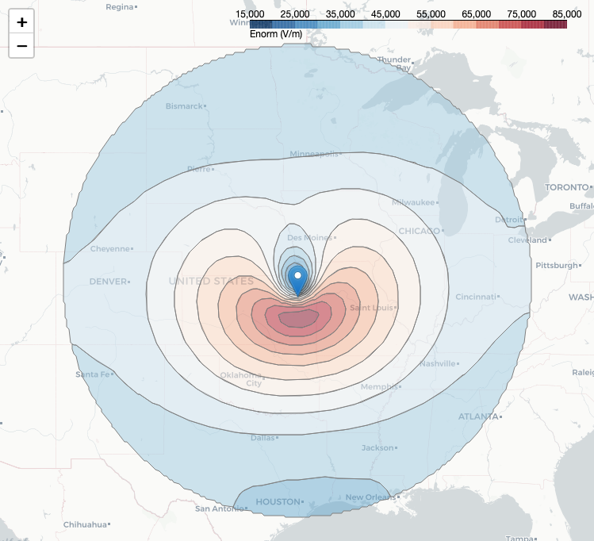

# The Karzas-Latter-Seiler Model of a High-Altitude Electromagnetic Pulse

## Introduction
This repository contains Python code for modeling the early (E1) phase of a high-altitude electromagnetic pulse (EMP). The EMP is modeled using a variant of the well-known [Karzas-Latter model](https://journals.aps.org/pr/abstract/10.1103/PhysRev.137.B1369) introduced by [Seiler](https://apps.dtic.mil/sti/citations/ADA009208). The code may be used to produce the characteristic "smile diagrams", which depict the peak intensity of the electric field over the surface of the Earth. The diagram below corresponds to a blast detonated 100 km directly overhead Topeka, Kansas.



## Contents
The key contents of this repository are:
- `emp/model.py`: a Python script containing the EMP model class, as well as other useful functions.
- `emp/geometry.py`: a Python script containing many useful geometrical helper functions
- `emp/constants.py`: a Python script containing constants of nature and default model parameters.
- `scripts/run_model.py`: a Python script illustrating the basic use of the code.
- `scripts/region_scan.py`: a Python script containing a function used to perform a 2d scan over latitude and longitude coordinates and generate the famous "smile diagrams", such as the one above.
- `notebooks/EMP Notebook.ipynb` a Jupyter notebook which walks through the math and implementation of the model
- `Seiler Digitized Data` a directory containing digitized data from select figures in the original Seiler report. The data was digitized using [this online tool](https://apps.automeris.io/wpd/).

## Installation
This repo can be installed using [Poetry](https://python-poetry.org/):
```
git clone git@github.com:gshartnett/karzas-latter-seiler.git
cd karzas-latter-seiler
poetry install
```

It is recommended to perform the Python installation within a virtual environment. If your machine has a GPU, then you will have to manually install the appropriate [PyTorch](https://pytorch.org/get-started/locally/) version.

In order to save the map images like the one pictured above, the Selenium Gecko driver must be added to the path. This can be done by following the instructions [here](https://stackoverflow.com/questions/40208051/selenium-using-python-geckodriver-executable-needs-to-be-in-path).

## Usage
The `EMP Notebook.ipynb` provides an introduction to the code usage. Additionally, the following commands may be run from the terminal:
- `python scripts/run_model.py` (solves the model for a range of times and a single target point)
- `python scripts/region_scan.py` (solves the model for a 2d grid of target points on the Earth's surface)
The default settings may be overridden by specifying optional flags. The help flag `-h` provides more details.

## License
This code is Copyright (C) 2023 RAND Corporation, and provided under the MIT license. See `LICENSE` for more information.

## Contact
Developed by [Gavin Hartnett](https://www.rand.org/about/people/h/hartnett_gavin_s.html) (email: hartnett@rand.org).
